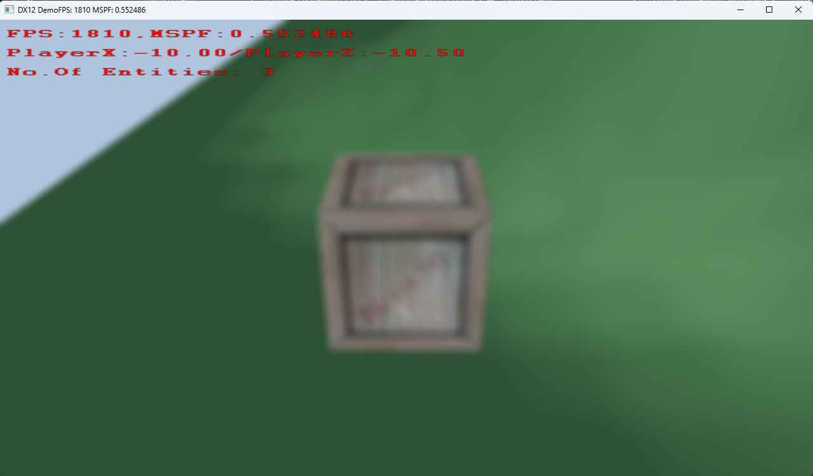

# 🎮 DX12 Real-Time Game Engine

> A custom real-time game engine built from scratch using DirectX 12, focused on explicit GPU programming, frame synchronization, and data-oriented architecture.

---

## ⚡ What This Project Is

This is a **low-level real-time engine** designed to replicate core systems found in modern game engines:

- Explicit DirectX 12 rendering pipeline
- GPU command submission architecture
- Frame synchronization (CPU/GPU parallel execution)
- Data-oriented scene and memory design
- Real-time gameplay + rendering integration

It is built to understand how real-time engines operate at the system level, not just how to use graphics APIs.

---

## 🧠 Core Engine Systems

### 🖼️ Rendering (DirectX 12)

- Multi-pass rendering pipeline
- Manual command list recording per pass
- Explicit GPU resource binding model (descriptor heaps, root signatures, PSOs)
- Resource state transitions and barrier-based synchronization model
- Explicit GPU command submission pipeline control

---

### ⏱ Frame System

- Triple-buffered frame architecture
- Fence-based CPU/GPU synchronization
- Frame-indexed resource management
- Safe parallel execution between CPU and GPU
- CPU builds frame N while GPU executes frame N-1

---

### 🧩 Scene Architecture

- Flat array entity storage (cache-efficient design)
- Slot reuse allocation system (no fragmentation)
- Chunk-based world partitioning system
- Octree spatial structure for fast queries and culling
- Terrain system integrated per chunk (heightmap-driven world data)

---

### 🌍 Terrain System

- Heightmap-based terrain per chunk
- Each chunk contains its own vertex grid and spacing data
- Terrain rendered as a triangulated grid (two triangles per quad)
- Player movement is terrain-aware:
  - Converts world position → chunk space
  - Identifies current terrain quad
  - Determines which triangle of the quad the player is over
  - Uses triangle-based interpolation for height sampling
- Ensures gameplay surface matches rendered geometry exactly
- Prevents mismatch between physics, collision, and rendering

---

### 🎮 Input & Gameplay System

- Keyboard + Xbox controller support
- Multithreaded double-buffered input system
- Third-person movement system:
  - Walk / run / sprint scaling
  - Context-aware dash mechanics

---

### ⚔️ Collision System

- AABB-based collision detection for entity interactions
- Terrain collision integrated via height sampling and triangle interpolation
- Real-time gameplay validation and physics approximation
- Prevents clipping, floating, and terrain desync issues

---

### 🔊 Audio System (WIP)

- Looping background audio playback system
- One-shot sound trigger via Xbox RT input
- Dynamic audio mixing system:
  - Background audio fades down to ~0.4 volume
  - One-shot audio fades in from 0 → 1.0 over ~50ms
  - One-shot fades out in final ~50ms
  - Background audio returns to full volume (1.0)
- Designed for smooth, non-jarring audio transitions
- Supports layered audio blending for gameplay feedback

---

### 🧪 Rendering Features

- Font rendering (quad + atlas sampling)
- Compute shader 2-pass blur
- Terrain rendering (heightmap-based)
- Phong lighting model

---

## 🎮 Controls

### Keyboard (Debug)

- **F** → Toggle fullscreen / windowed mode  
- **D** → Toggle debug UI window  

---

### Xbox Controller

- Left Stick:
  - &lt; 50% → slow walk  
  - &gt;= 50% → normal walk  

- Hold B while moving → Run  

- Press B from idle:
  - Short intent window (~X seconds):
    - If movement intent detected → run from idle
    - Otherwise → backwards dash

- RT (Right Trigger):
  - Triggers one-shot audio event with dynamic audio blending system

---

## ⚙️ Performance Design Philosophy

- Flat memory layouts (cache-friendly design)
- Minimal pointer indirection
- Explicit resource ownership
- Deterministic frame behavior
- No hidden engine magic

> Every CPU/GPU interaction is intentional and visible.

---

## 🧱 Tech Stack

- C++ (ISO C++17)
- DirectX 12
- HLSL
- Win32 API
- Multithreaded CPU systems

---

## 📐 Engine Execution Flow (High-Level Mental Model)

> The engine is structured around explicit CPU/GPU parallelism:
>
> The CPU builds commands for the current frame while the GPU may still be executing work from previous frames.
> Before reusing frame-indexed resources, the engine waits on the associated fence value to ensure GPU completion.

### Initialization
- Initialize subsystems (camera, scene, input, rendering, spatial structures)

### Main Loop
- Poll double-buffered input system
- Update simulation systems (world, camera, gameplay)
- Perform collision detection (AABB)
- Synchronize frame using fences
- Execute render pass system
- Record DirectX 12 command lists (GPU submission pipeline)
- Submit work via GPU command queue
- Present frame

---

## 📚 Resources & Inspiration

This project is informed by industry-standard graphics and engine development resources:

- **Introduction to 3D Game Programming with DirectX 12 (Frank Luna)**
- **Game Engine Architecture (Jason Gregory)**
- **Microsoft DirectX 12 Documentation**

Additional learning comes from iterative engine development, GPU debugging, and system-level experimentation.

---

## 📌 What This Demonstrates

- Real-time engine architecture from first principles
- Explicit GPU submission and frame scheduling systems
- Low-level graphics API proficiency (DirectX 12)
- Barrier-based synchronization and resource lifetime management
- Data-oriented performance engineering
- Integration of rendering, gameplay, collision, physics, and audio systems
- CPU/GPU parallel execution model understanding

---

## 🧭 Current Work

- Planar reflection system (render-to-texture)
- Pre-shadow projection experiments
- Audio system expansion (mixing + spatial audio improvements)

---

## 🚀 Future Work

- Dynamic chunk streaming system (world loading around player)
- Shadow mapping system
- FBX skeletal animation system
- Physically Based Rendering (PBR)
- Render graph architecture
- Frustum culling (octree-driven)
- Wireframe debug rendering mode
- Advanced audio system (3D spatialization)

---

## 📸 Media

### 🖼️ Screenshots

#### Debug UI

#### Terrain Rendering

#### Blur Effect

---

### 🎥 Videos

- Terrain traversal system (heightmap + triangle interpolation)
- AABB wall collision demonstration
- Full engine gameplay / rendering demo
- Camera movement + scene navigation

---

## 🧠 Why This Project Exists

Built to bridge professional software engineering experience into real-time graphics programming by implementing engine systems from scratch, focusing on:

- GPU programming models
- Engine architecture design
- Performance-critical system design