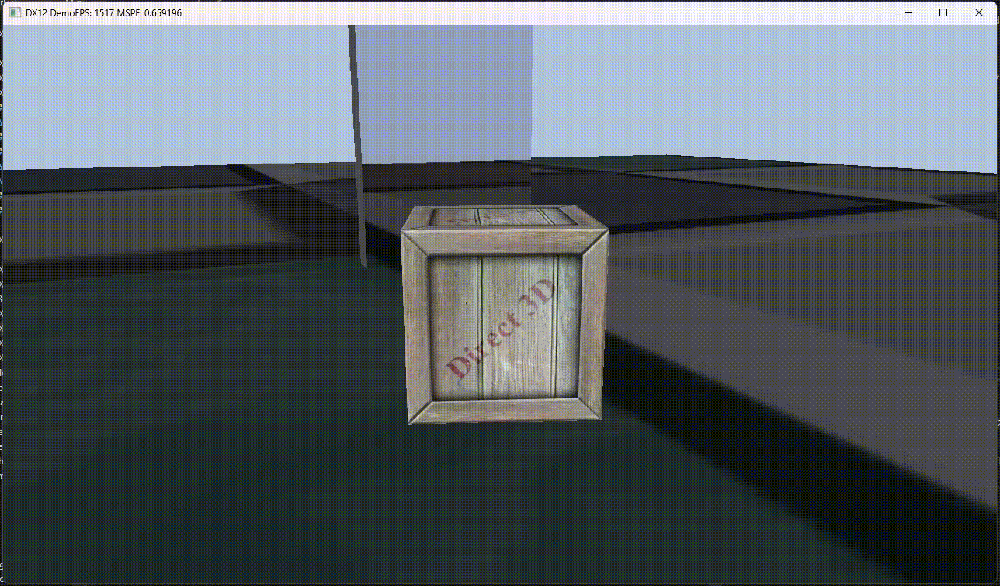
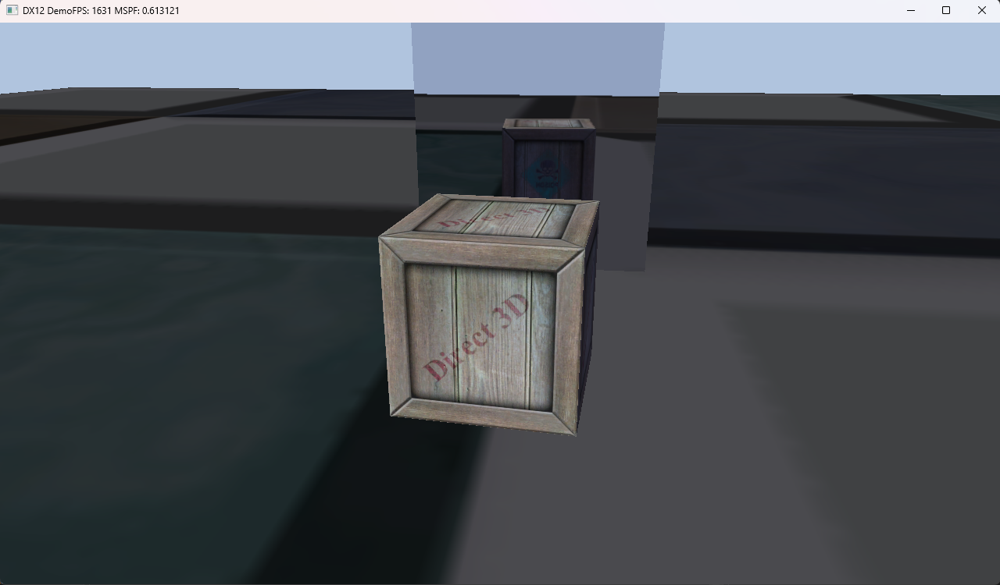

# 🎮 DX12 Real-Time Game Engine

A custom real-time game engine built from scratch using DirectX 12, focusing on explicit GPU programming, frame synchronization, engine architecture, and data-oriented design.

---

## ⚡ Core Philosophy
This is a **low-level real-time engine** designed to replicate systems found in modern commercial titles. Every CPU/GPU interaction is intentional, explicit, and visible.
* **Data-Oriented:** Flat memory layouts, minimal pointer indirection, and cache-efficient designs.
* **Explicit Control:** Manual command recording, barrier synchronization, and deterministic frame behavior.

---

## 🧠 Engine Subsystems

### 🖼️ Rendering Pipeline (DirectX 12)
* **Architecture:** Multi-pass pipeline with manual command list recording per pass.
* **Resource Binding:** Explicit model via descriptor heaps, root signatures, and Pipeline State Objects (PSOs).
* **Synchronization:** Resource state transitions governed by barrier-based synchronization models.
* **Mesh System:** Shared geometry via Mesh → SubMesh architecture with instance-specific material/texture overrides.
* **Planar Reflections:** Real-time planar reflection system utilizing dynamic render-to-texture passes.
* **Lighting & Effects:** Phong lighting model, heightmap-based terrain rendering, font atlas sampling, and a 2-pass compute shader blur.

### ⏱️ Frame & Execution System
* **Parallelism:** Triple-buffered frame architecture utilizing fence-based CPU/GPU synchronization.
* **Scheduling:** CPU builds frame $N$ while the GPU executes frame $N-1$, preventing CPU/GPU stalls.
* **Execution Flow:** 1. Poll double-buffered input system.
  2. Update simulation (world, camera, gameplay).
  3. Perform AABB & terrain-interpolated collision queries.
  4. Synchronize frame resources using fences.
  5. Record & submit DX12 command lists; resolve GPU profiling queries; Present.

### 🧩 Scene & Terrain Management
* **Lifecycle:** `WorldManager` drives scene lifecycles defined via declarative `SceneBlueprint` structures.
* **Memory Layout:** Entities are spawned into flat arrays (cache-efficient design) with a fragmentation-free slot reuse system.
* **Spatial Partitioning:** Octree spatial structure used for fast queries and culling.
* **Terrain Height Sampling:** Heightmap-driven chunk terrain. Player movement is terrain-aware, sampling triangle-based interpolation of the underlying quad to ensure exact collision and rendering synchronization.

### 🎮 Input & Gameplay System
* Multithreaded, double-buffered input tracking both Keyboard and Xbox Controller states.
* Context-aware movement (walk/run/sprint scaling) and intent-buffered transitions (e.g., backwards dash).

### 🔊 Audio System
* Driven by a 64MB fixed `AudioMemoryArena`.
* **Runtime Mixer:** Background audio dynamically ducks to 0.4 volume during one-shot SFX playback. Features non-blocking runtime volume interpolation with ~50ms DSP-style fade curves.

### 📊 Performance Instrumentation
* **GPU Profiling:** Built-in timestamp profiling using DirectX 12 timestamp queries.
* **Zero Stall:** Batched query resolution at frame-end paired with a frame-delayed readback architecture avoids pipeline serialization stalls. Timings are displayed via the engine debug UI.

---

## 🎮 Controls

### Keyboard (Debug)
* **F** → Toggle fullscreen / windowed mode
* **D** → Toggle debug UI window

### Xbox Controller
* **Left Stick:** $< 50\%$ Slow walk | $\ge 50\%$ Normal walk
* **Hold B (Moving):** Run
* **Press B (Idle):** Intent-buffered window (Movement detected $\rightarrow$ Run | Otherwise $\rightarrow$ Backwards dash)
* **Press RB:** Play one-shot SFX (Triggers dynamic audio ducking mixer)

---

## 🧱 Tech Stack
* **Language:** C++ (ISO C++17)
* **Graphics API:** DirectX 12 (HLSL)
* **OS Interface:** Win32 API
* **Dependencies:** Multithreaded CPU core systems

---

## 🧭 Project Status

### Current Focus
* Enhancing planar reflection pass efficiency
* Pre-shadow projection experiments
* Skeletal animation pipeline foundations

### Future Roadmap
* Dynamic runtime chunk streaming around player
* Shadow mapping & Frustum culling (octree-driven)
* Physically Based Rendering (PBR) & Render Graph architecture
* Advanced audio (3D spatialization)

---

## 📸 Media

### 🎥 Engine Demonstrations

* **Planar Reflections (Mirror)**
  
  *🎥 Raw Video:* [Watch High-Res MP4](Docs/Videos/Mirror-Demo.mp4)

* **Full Engine Demo (Terrain, Collision, & Movement)**
  
  *🎥 Raw Video:* [Watch High-Res MP4](Docs/Videos/Full-Engine-Demo.mp4)

* **Debug UI, GPU Profiler, & Compute Shader Blur**
  
  *🎥 Raw Video:* [Watch High-Res MP4](Docs/Videos/Full-Engine-Demo.mp4)

* **Dynamic Audio System**
  *🎥 Raw Video:* [Watch Audio Ducking Demo](Docs/Videos/Audio-Ducking-Demo.mp4)

---

### 🖼️ Screenshots

| Planar Reflections | GPU Profiler UI | Terrain Rendering | Blur Compute Pass |
| :---: | :---: | :---: | :---: |
|  |  |  |  |

---

## 📚 Resources & Inspiration
* *Introduction to 3D Game Programming with DirectX 12* — Frank Luna
* *Game Engine Architecture* — Jason Gregory
* *Microsoft DirectX 12 Documentation*