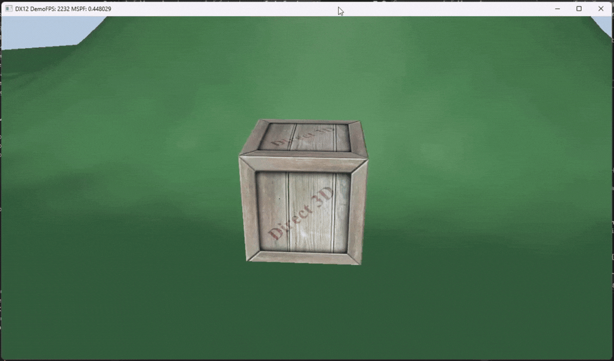
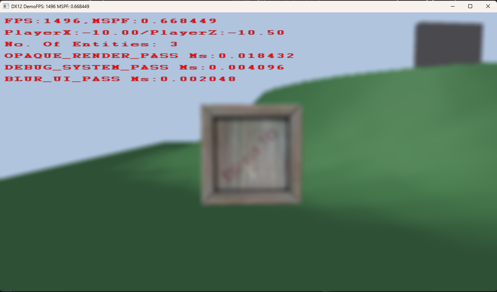
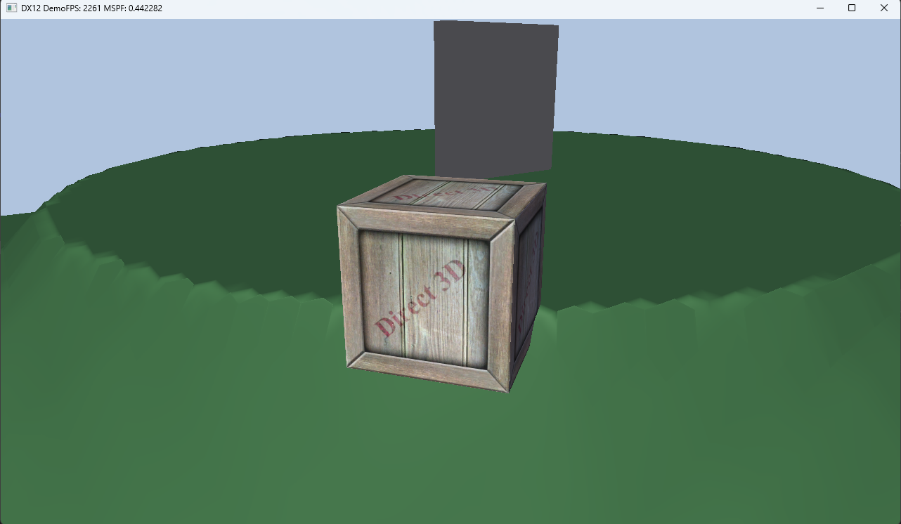
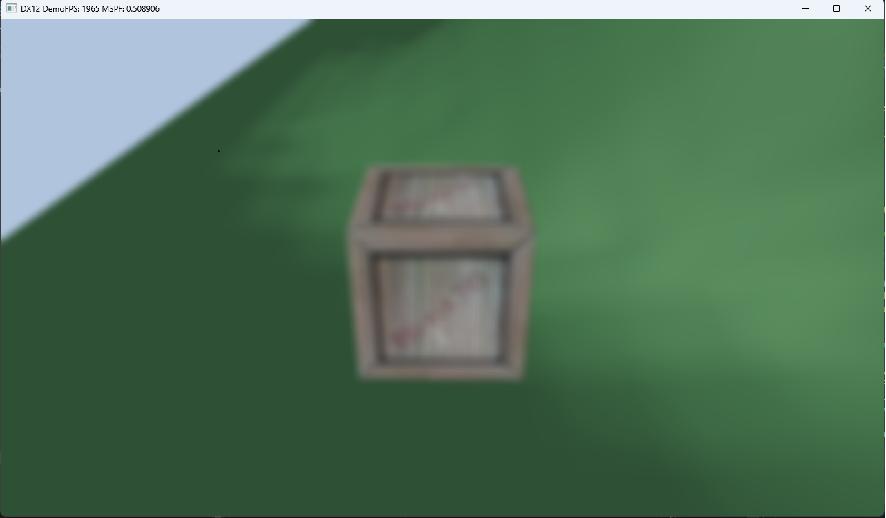

# 🎮 DX12 Real-Time Game Engine

A custom real-time game engine built from scratch using DirectX 12, focused on explicit GPU programming, frame synchronization, engine architecture, and data-oriented design.

---

## ⚡ What This Project Is

This is a **low-level real-time engine** designed to replicate core systems found in modern game engines:

- Explicit DirectX 12 rendering pipeline
- GPU command submission architecture
- Frame synchronization (CPU/GPU parallel execution)
- Data-oriented scene and memory design
- Scene-driven world loading system
- Real-time gameplay, rendering, collision, and audio integration

It is built to understand how real-time engines operate at the system level, not just how to use graphics APIs.

---

## 🧠 Core Engine Systems

### 🖼️ Rendering (DirectX 12)

- Multi-pass rendering pipeline
- Manual command list recording per pass
- Explicit GPU resource binding model (descriptor heaps, root signatures, PSOs)
- Resource state transitions and barrier-based synchronization model
- Explicit GPU command submission pipeline control
- Mesh → SubMesh rendering architecture
- Per-entity material and texture overrides
- Shared geometry with instance-specific rendering state

---

### ⏱ Frame System

- Triple-buffered frame architecture
- Fence-based CPU/GPU synchronization
- Frame-indexed resource management
- Safe parallel execution between CPU and GPU
- CPU builds frame N while GPU executes frame N-1

---

### 🧩 Scene Management System

- SceneFactory-driven scene creation system
- SceneBlueprint-based declarative scene definitions
- WorldManager responsible for scene lifecycle and loading
- Entity spawning via blueprint parameters into flat arrays
- Player entity stored in fixed slot 0 for deterministic access
- Chunk-based world system starting at (0,0)

**Current Flow:**

- SceneFactory generates SceneBlueprint
- WorldManager loads scene
- Entities are placed into:
  - Slot 0 → Player
  - Chunk (0,0) → World entities
- Flat array entity storage (cache-efficient design)
- Slot reuse allocation system (no fragmentation)
- Chunk-based world partitioning system
- Octree spatial structure for fast queries and culling
- Terrain system integrated per chunk (heightmap-driven world data)

**Future:**

- Runtime chunk streaming around player position
- Dynamic world loading/unloading

---

### 🌍 Terrain System

- Heightmap-based terrain per chunk
- Each chunk contains its own vertex grid and spacing data
- Terrain rendered as a triangulated grid (two triangles per quad)
- Player movement is terrain-aware:
  - Converts world position → chunk space
  - Identifies current terrain quad
  - Determines which triangle of the quad the player is over
  - Uses triangle-based interpolation for height sampling
- Ensures gameplay surface matches rendered geometry exactly
- Prevents mismatch between physics, collision, and rendering

---

### 🎮 Input & Gameplay System

- Keyboard + Xbox controller support
- Multithreaded double-buffered input system
- Third-person movement system:
  - Walk / run / sprint scaling
  - Context-aware dash mechanics
  - Intent-buffered transitions

---

### ⚔️ Collision System

- AABB-based collision detection for entity interactions
- Terrain collision integrated via height sampling and triangle interpolation
- Real-time gameplay validation and physics approximation
- Prevents clipping, floating, and terrain desync issues

---

### 🔊 Audio System

- AudioMemoryArena (64MB audio pool)
- Looping background audio playback
- One-shot SFX triggered via RB input
- Runtime audio mixing and ducking system
- Supports layered audio blending for gameplay feedback

**Mixing System:**

- Background audio ducks to 0.4 volume during SFX playback
- One-shot audio fades in (0 → 0.7 over ~50ms)
- One-shot audio fades out during final ~50ms
- Background audio smoothly returns to full volume
- Non-blocking runtime volume interpolation

---

### 🖼️ Rendering Features

- Terrain rendering (heightmap-based)
- Font rendering (quad + atlas sampling)
- Compute shader 2-pass blur
- Phong lighting model

---

### 📊 Performance & Debugging

- Built-in GPU profiling system using DirectX 12 timestamp queries
- Records GPU execution time for individual render passes
- Batched query resolution at the end of each frame to minimise profiling overhead
- Frame-delayed readback architecture avoids CPU/GPU synchronization stalls
- GPU timestamps converted into millisecond timings using hardware timestamp frequency
- Profiling data visualised directly within the engine debug UI
- Enables real-time analysis of render pass performance and GPU bottlenecks

---

## 🎮 Controls

### Keyboard (Debug)

- **F** → Toggle fullscreen / windowed mode
- **D** → Toggle debug UI window

---

### Xbox Controller

- Left Stick:
  - &lt; 50% → Slow walk
  - &gt;= 50% → Normal walk

- Hold **B** while moving → Run

- Press **B** from idle:
  - Short intent window (~X seconds)
  - If movement intent detected → Run from idle
  - Otherwise → Backwards dash

- Press **RB**:
  - Plays one-shot SFX
  - Triggers runtime audio mixing system

---

## ⚙️ Performance Design Philosophy

- Flat memory layouts (cache-efficient design)
- Minimal pointer indirection
- Explicit resource ownership
- Deterministic frame behavior
- No hidden engine magic

Every CPU/GPU interaction is intentional and visible.

---

## 🧱 Tech Stack

- C++ (ISO C++17)
- DirectX 12
- HLSL
- Win32 API
- Multithreaded CPU systems

---

## 📐 Engine Execution Flow (High-Level Mental Model)

The engine is structured around explicit CPU/GPU parallelism.

The CPU builds commands for the current frame while the GPU may still be executing work from previous frames. Before reusing frame-indexed resources, the engine waits on the associated fence value to ensure GPU completion.

### Initialization

- Initialize subsystems (camera, scene, input, rendering, audio, spatial structures)

---

### Main Loop

- Poll double-buffered input system
- Update simulation systems (world, camera, gameplay)
- Perform collision detection (AABB)
- Synchronize frame using fences
- Execute render pass system
- Record DirectX 12 command lists
- Submit work via GPU command queue
- Resolve GPU profiling queries
- Present frame

---

## 📚 Resources & Inspiration

This project is informed by industry-standard graphics and engine development resources:

- **Introduction to 3D Game Programming with DirectX 12** — Frank Luna
- **Game Engine Architecture** — Jason Gregory
- **Microsoft DirectX 12 Documentation**

Additional learning comes from iterative engine development, GPU debugging, performance profiling, and low-level systems development.

---

## 📌 What This Demonstrates

- Real-time engine architecture
- Explicit GPU submission and frame scheduling systems
- Low-level graphics API proficiency (DirectX 12)
- Barrier-based synchronization and resource lifetime management
- GPU performance instrumentation and profiling
- Engine tooling and debugging infrastructure
- Scene system and world streaming design
- Audio mixing and runtime DSP-style control
- Data-oriented architecture (flat arrays, chunking)
- Asset ownership and instance-based rendering architecture
- Integration of rendering, gameplay, collision, physics, and audio systems
- CPU/GPU parallel execution model understanding

---

## 🧭 Current Work

- Planar reflection system (render-to-texture)
- Pre-shadow projection experiments
- Skeletal animation pipeline foundations
- Multi-submesh mesh architecture

---

## 🚀 Future Work

- Dynamic chunk streaming system (world loading around player)
- Shadow mapping system
- FBX skeletal animation system
- Physically Based Rendering (PBR)
- Render graph architecture
- Frustum culling (octree-driven)
- Wireframe debug rendering mode
- Advanced audio system (3D spatialization)

---

## 📸 Media

### 🎥 Videos

#### Full Engine Demo GIF (Terrain Traversal, Collision, Camera, Movement)

#### Full Engine Demo Video

[Watch Video](Docs/Videos/Full-Engine-Demo.mp4)

#### Debug UI + Blur GIF

#### Debug UI + Blur Video

[Watch Video](Docs/Videos/Debug-UI-And-Blur-Demo.mp4)

#### Audio Ducking Demo

[Watch Video](Docs/Videos/Audio-Ducking-Demo.mp4)

---

### 🖼️ Screenshots

#### Debug UI with Profiling

#### Terrain Rendering

#### Blur Effect

#### GPU Profiling

---

## 🧠 Why This Project Exists

Built to implement a real-time engine from scratch focusing on:

- GPU programming models
- Engine architecture design
- Data-oriented systems
- Rendering pipelines
- Performance analysis and profiling
- Performance-critical software engineering